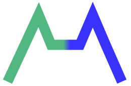

# CityHack22 Project Submission
## Project: Concatenate


## Team: Rude Kittens
## Members
- Assan KOZHIN (Leader)
- Glenn SALTER
- Nurdaulet TAUMERGENOV
- Alibi ZHENIS
- Nikita CHE

## Project concept
AI-driven electricity demand (load) forecasting for electric power companies (B2B)

## Problem statement
Accurate electricity demand forecasting is essential to power companies for both meeting customer demand and minimising costs by avoiding overgenerating. Accurate load forecasts can result in significant cost savings and profits for generation asset owners
Overgenerate causes the damage of infrastructure

## Target market
Electricity sector companies in Hong Kong
1. Hongkong Electric Company
2. CLP Power Hong Kong Limited

## Additional Information
Accurate models for electric power load forecasting are essential to the operation and planning of a utility company. Load forecasting helps an electric utility to make important decisions including decisions on purchasing and generating electric power, load switching, and infrastructure development.
Electricity is produced by a variety of generating units, each with different lead times and costs to be readied for service, and production costs once brought online. Because electricity is a commodity that cannot be easily stored, generation should match consumption at any given time; therefore, the cost of generating electricity has a direct relationship to electricity demand, typically referred to as electricity load.
An accurate load forecast enables generators to optimize the mix of generating units that can serve the expected load while minimizing the production costs. 

# 3 Most Impactful Features of the Project
1. AI Driven Electricity Dermand Forecasting
Based on uploaded dataset and machine learning model, we can predict electricity demand in the future 2 months.


2.  Past and Forecasted Demand Visualization
Both past and forecasted data are displayed visually in the platform dashboard.


3. Export Forecasted Electricity Demand Data
Forecasted electricity demand can be downloaded in csv or excel format.


## Tech used (as many as required)
1. Django
2. Bootstrap, Chart.js
3. StatsModels

## Important
We expect to have some specific format of `*.xlsx` file. Use the file provided in the repo. 


## Link
- [demo video](https://drive.google.com/file/d/18l23kmwArCwmh-p5iqQl8P1euS7X1KHk/view?usp=sharing)

## How to run Demo?
1. Clone repo
```
git clone https://github.com/poiug07/CityHack2022_Rude_Kittens.git
```
2. Go to Folder /CityHack2022_Rude_Kittens/
```
cd CityHack2022_Rude_Kittens/
```
3. Create your virtual enviroment inside /CityHack2022_Rude_Kittens/
```
venv env
```
4. Run your enviroment
```
source env/bin/activate
```
5. Install required libraries
```
pip install -r requirements.txt 
```
6. Run server
```
python manage.py runserver
```


